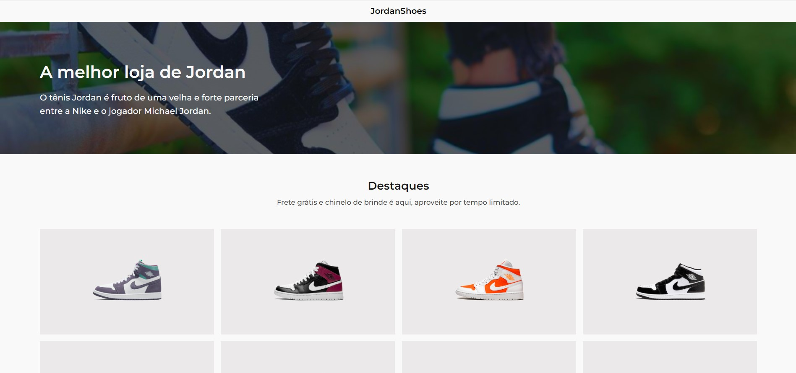

# JordanShoes
 

Uma desafio front-end proposto pela comunidade codelândia, criar uma landing page para sapatos de modelo jordan.

> 🎯 Desafio #2

[Acesse aqui o site](https://ericodesenvolvedor.github.io/jordan-shoes/)

### Ferramentas utilizadas

- HTML
- CSS
- Figma

### Responsivo 

- Layout responsivo.

Criado com :heart: por 
  <a href="https://github.com/Ericodesenvolvedor">ericodesenvolvedor</a>

 
